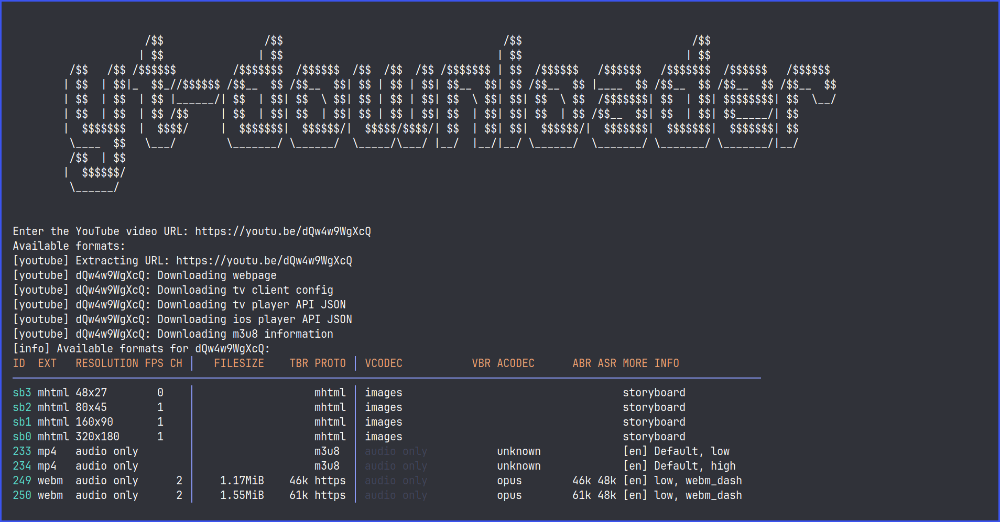

# 🎵 yt-downloader

A simple yet powerful **bash script** that automates downloading videos and audio using the `yt-dlp` CLI tool.  
All downloaded URLs are automatically saved to `~/.yt_videos_history.txt` for easy reference and tracking.

---



---

## ✨ Features

- Download videos or audio from supported platforms
- Automatically logs all downloads
- Lightweight and easy to run from terminal
- No setup beyond `yt-dlp` dependency

## 📦 Requirements

- [`yt-dlp`](https://github.com/yt-dlp/yt-dlp) must be installed and available in your system’s `$PATH`

## 🛠️ Installation

Clone the repo and run the script directly:

```bash
git clone https://github.com/VexilonHacker/yt-downloader.git
cd yt-downloader
bash yt-downloader.sh
